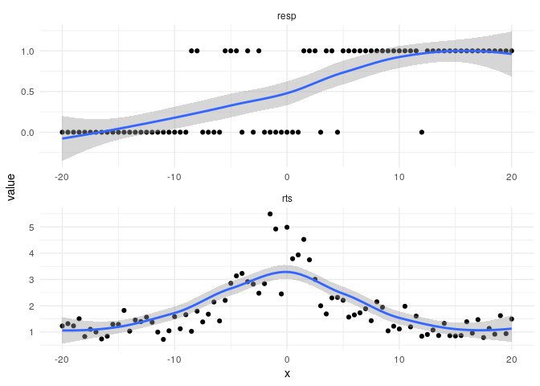
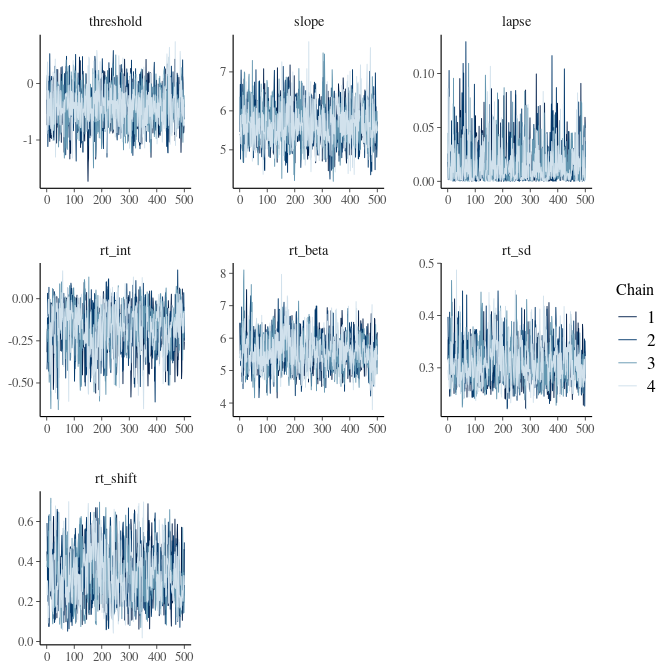
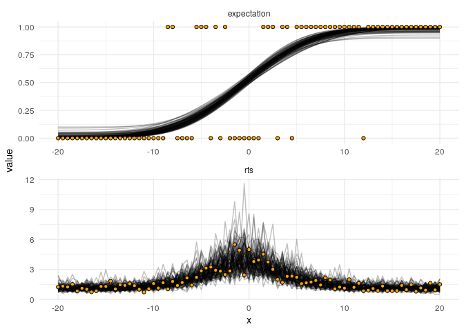

Psychometric and RT joint modeling
================
Jesper Fischer Ehmsen
2024-09-20

#### Plate notation of single subject (without Non-decision time)


#### Packages and scripts

### Simulate agent with known parameter values:

``` r
parameters = data.frame(threshold = 0, slope = 5, lapse = 0.05,
                        rt_int = 0, rt_beta = 5, rt_sd = 0.3, rt_shift = 0.5,
                        minRT = 0.2, participant = 1, stimulus = "random")

df = simulate_psychometric(parameters)
```

    ## [1] "Using randomly simulated stimulus values"

    ## Warning: Returning more (or less) than 1 row per `summarise()` group was deprecated in
    ## dplyr 1.1.0.
    ## ℹ Please use `reframe()` instead.
    ## ℹ When switching from `summarise()` to `reframe()`, remember that `reframe()`
    ##   always returns an ungrouped data frame and adjust accordingly.
    ## Call `lifecycle::last_lifecycle_warnings()` to see where this warning was
    ## generated.

### Plotting

``` r
plot_joint_rts_single(df)
```

    ## `geom_smooth()` using method = 'loess' and formula = 'y ~ x'

<!-- -->

### Fitting

``` r
mod = cmdstanr::cmdstan_model(here::here("stanmodels",
                                         "joint_rt.stan"))

datastan = list(N = nrow(df),
                resp = df$resp,
                RT = df$rts,
                stim = df$x)

fit <- mod$sample(
  data = datastan,
  iter_sampling = 500,
  iter_warmup = 500,
  chains = 4,
  parallel_chains = 4,
  refresh = 0,
  adapt_delta = 0.8,
  max_treedepth = 10
)
```

    ## Running MCMC with 4 parallel chains...

    ## Chain 2 Informational Message: The current Metropolis proposal is about to be rejected because of the following issue:

    ## Chain 2 Exception: lognormal_lpdf: Scale parameter is inf, but must be positive finite! (in '/tmp/RtmpG4J48Y/model-19262c93b81.stan', line 94, column 2 to column 65)

    ## Chain 2 If this warning occurs sporadically, such as for highly constrained variable types like covariance matrices, then the sampler is fine,

    ## Chain 2 but if this warning occurs often then your model may be either severely ill-conditioned or misspecified.

    ## Chain 2

    ## Chain 3 Informational Message: The current Metropolis proposal is about to be rejected because of the following issue:

    ## Chain 3 Exception: lognormal_lpdf: Scale parameter is inf, but must be positive finite! (in '/tmp/RtmpG4J48Y/model-19262c93b81.stan', line 94, column 2 to column 65)

    ## Chain 3 If this warning occurs sporadically, such as for highly constrained variable types like covariance matrices, then the sampler is fine,

    ## Chain 3 but if this warning occurs often then your model may be either severely ill-conditioned or misspecified.

    ## Chain 3

    ## Chain 1 finished in 0.8 seconds.
    ## Chain 2 finished in 0.9 seconds.
    ## Chain 3 finished in 0.8 seconds.
    ## Chain 4 finished in 0.8 seconds.
    ## 
    ## All 4 chains finished successfully.
    ## Mean chain execution time: 0.8 seconds.
    ## Total execution time: 1.2 seconds.

## Check diagnostics:

``` r
mcmc_trace(fit$draws(names(parameters)[1:7]))
```

<!-- -->

``` r
mcmc_pairs(fit$draws(names(parameters)[1:7]), np = nuts_params(fit))
```

<!-- -->

## Table of results

``` r
flextable::flextable(fit$summary(names(parameters)[1:7]) %>% 
                       select(variable,mean,median,q5,q95,
                              ess_bulk,ess_tail,rhat))
```


## Plot joint posterior draws over the data:

``` r
n_draws = 100
id_draws = sample(1:2000,n_draws)

as_draws_df(fit$draws(names(parameters)[1:7])) %>% 
  select(-contains(".")) %>% 
  mutate(draw = 1:n()) %>% filter(draw %in% id_draws) %>% 
  mutate(minRT = min(df$rts)) %>% 
  mutate(x = list(seq(-20,20,by = 0.5))) %>% 
  unnest() %>% rowwise() %>% 
  mutate(resp = list(generate_expect(x,threshold,slope,lapse,
                                     rt_int,rt_beta,rt_sd,
                                     rt_shift,minRT,1))) %>% 
  select(resp,draw) %>% 
  unnest() %>% 
  pivot_longer(cols = c("rts","expectation")) %>% 
  ggplot(aes(x = x, y = value, group = interaction(draw,name)))+
  geom_line(alpha = 0.25)+
  geom_point(data = df %>%  
               rename("rts" = "rts", "expectation" = "resp") %>% 
               pivot_longer(cols = c("rts","expectation")) %>% 
               mutate(draw = NA), aes(x = x, y = value),
             shape = 21, fill = "orange")+
  
  facet_wrap(~name, ncol = 1, scales = "free")+
  theme_minimal()
```

    ## Warning: Dropping 'draws_df' class as required metadata was removed.

    ## Warning: `cols` is now required when using `unnest()`.
    ## ℹ Please use `cols = c(x)`.

    ## Warning: `cols` is now required when using `unnest()`.
    ## ℹ Please use `cols = c(resp)`.

<!-- -->
